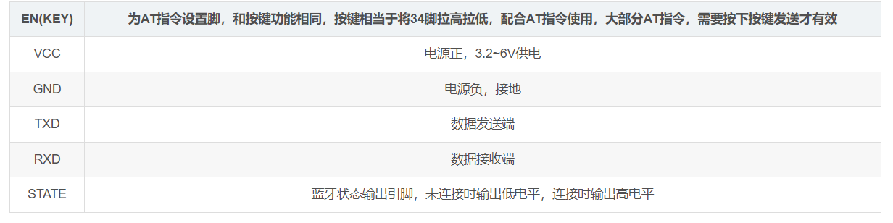
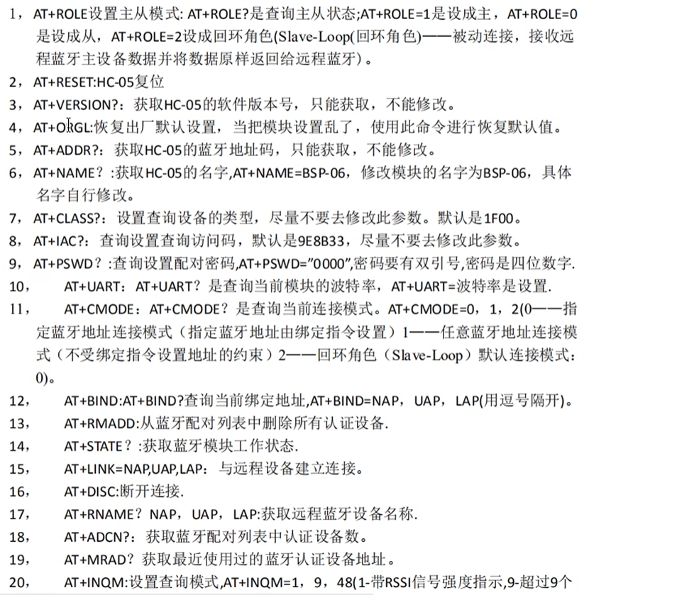

# EmbeddedStudy
1、模板
F103模板

2、模块
两个蓝牙通讯  
## 2025.6.14
### 找到Usart标准库的模板，目前完成对Usart1和Usart3的初始化，
```
#define DEBUG_USART              USART1
#define DEBUG_USART_CLK          RCC_APB2Periph_USART1
#define DEBUG_USART_TX_GPIO_CLK  RCC_APB2Periph_GPIOA
#define DEBUG_USART_RX_GPIO_CLK  RCC_APB2Periph_GPIOA
#define DEBUG_USART_TX_GPIO_PIN  GPIO_Pin_9
#define DEBUG_USART_RX_GPIO_PIN  GPIO_Pin_10
#define DEBUG_USART_TX_GPIO_PORT GPIOA
#define DEBUG_USART_RX_GPIO_PORT GPIOA
#define DEBUG_USART_IRQn         USART1_IRQn
#define DEBUG_USART_BAUDRATE     115200
void DEBUG_USART_Config(void)
{
    GPIO_InitTypeDef  GPIO_InitStructure;
    USART_InitTypeDef USART_InitStructure;
    NVIC_InitTypeDef  NVIC_InitStructure;

    RCC_APB2PeriphClockCmd(DEBUG_USART_CLK, ENABLE);

    RCC_APB2PeriphClockCmd(DEBUG_USART_TX_GPIO_CLK | DEBUG_USART_RX_GPIO_CLK, ENABLE);


    GPIO_InitStructure.GPIO_Pin   = DEBUG_USART_TX_GPIO_PIN;
    GPIO_InitStructure.GPIO_Speed = GPIO_Speed_50MHz;
    GPIO_InitStructure.GPIO_Mode  = GPIO_Mode_AF_PP;
    GPIO_Init(DEBUG_USART_TX_GPIO_PORT, &GPIO_InitStructure);


    GPIO_InitStructure.GPIO_Pin   = DEBUG_USART_RX_GPIO_PIN;
    GPIO_InitStructure.GPIO_Mode  = GPIO_Mode_IN_FLOATING;
    GPIO_Init(DEBUG_USART_RX_GPIO_PORT, &GPIO_InitStructure);


    NVIC_InitStructure.NVIC_IRQChannel                   = DEBUG_USART_IRQn;
    NVIC_InitStructure.NVIC_IRQChannelPreemptionPriority = 1;    // ???????????
    NVIC_InitStructure.NVIC_IRQChannelSubPriority        = 0;
    NVIC_InitStructure.NVIC_IRQChannelCmd                = ENABLE;
    NVIC_Init(&NVIC_InitStructure);


    USART_InitStructure.USART_BaudRate            = DEBUG_USART_BAUDRATE;
    USART_InitStructure.USART_WordLength          = USART_WordLength_8b;
    USART_InitStructure.USART_StopBits            = USART_StopBits_1;
    USART_InitStructure.USART_Parity              = USART_Parity_No ;
    USART_InitStructure.USART_HardwareFlowControl = USART_HardwareFlowControl_None;
    USART_InitStructure.USART_Mode                = USART_Mode_Rx | USART_Mode_Tx;

    USART_Init(DEBUG_USART, &USART_InitStructure);


    USART_ITConfig(DEBUG_USART, USART_IT_RXNE, ENABLE);


    USART_Cmd(DEBUG_USART, ENABLE);
}
```
其中碰到一个问题就是，上述代码初始化Usart1串口打印没有问题（即Usart_SendString( USART1,"Debug串口正常\n")有输出），但是相同的代码初始化Usart3有问题，下面是发送函数定义其是polling发送的
```
/*****************  发送一个字节 **********************/
void Usart_SendByte( USART_TypeDef * pUSARTx, uint8_t ch)
{
	/* 发送一个字节数据到USART */
	USART_SendData(pUSARTx,ch);
		
	/* 等待发送数据寄存器为空 */
	while (USART_GetFlagStatus(pUSARTx, USART_FLAG_TXE) == RESET);	
}

/****************** 发送8位的数组 ************************/
void Usart_SendArray( USART_TypeDef * pUSARTx, uint8_t *array, uint16_t num)
{
  uint8_t i;
	
	for(i=0; i<num; i++)
  {
	    /* 发送一个字节数据到USART */
	    Usart_SendByte(pUSARTx,array[i]);	
  
  }
	/* 等待发送完成 */
	while(USART_GetFlagStatus(pUSARTx,USART_FLAG_TC)==RESET);
}

/*****************  发送字符串 **********************/
void Usart_SendString( USART_TypeDef * pUSARTx, char *str)
{
	unsigned int k=0;
  do 
  {
      Usart_SendByte( pUSARTx, *(str + k) );
      k++;
  } while(*(str + k)!='\0');
  
  /* 等待发送完成 */
  while(USART_GetFlagStatus(pUSARTx,USART_FLAG_TC)==RESET)
  {}
}

/*****************  发送一个16位数 **********************/
void Usart_SendHalfWord( USART_TypeDef * pUSARTx, uint16_t ch)
{
	uint8_t temp_h, temp_l;
	
	/* 取出高八位 */
	temp_h = (ch&0XFF00)>>8;
	/* 取出低八位 */
	temp_l = ch&0XFF;
	
	/* 发送高八位 */
	USART_SendData(pUSARTx,temp_h);	
	while (USART_GetFlagStatus(pUSARTx, USART_FLAG_TXE) == RESET);
	
	/* 发送低八位 */
	USART_SendData(pUSARTx,temp_l);	
	while (USART_GetFlagStatus(pUSARTx, USART_FLAG_TXE) == RESET);	
}
```
出现Usart3无法工作的原因在于错误地打开了 USART3 的接收中断，却没有提供对应的中断处理与清标志代码，导致 MCU 卡在伪中断里，主循环里的发送根本没机会跑。
#### 所以移植到Usart3时就要删除USART_ITConfig(DEBUG_USART, USART_IT_RXNE, ENABLE) 或者对USART3_IRQHandler进行定义，删除标志位
```
void USART3_IRQHandler(void)
{
    if (USART_GetITStatus(USART3, USART_IT_RXNE))
    {
        volatile uint8_t dummy = USART_ReceiveData(USART3);
        USART_ClearITPendingBit(USART3, USART_IT_RXNE);
    }
    // …如果还开了 IDLE、TXE 中断，也都要同样清标志…
}

```
USART1 之所以没卡在“伪中断”里，最主要的差别在于它的 RX 引脚是实实在在连在 CH340 模块的 TXD 上，并且在空闲时被拉到了一个稳定的高电平；而你一开始的 USART3 RX（PB11）要么是浮空、要么连在一个噪声很大的地方，就更容易产生“垃圾”帧，从而触发 RXNE。

### HC05引脚说明



基本完成两个蓝牙通讯的功能


## 2025.7.11
### SysTick_Config函数的学习
该函数的代码注释如下图所示
```
static __INLINE uint32_t SysTick_Config(uint32_t ticks)
{ 
  if (ticks > SysTick_LOAD_RELOAD_Msk)
    return (1);    /* 如果重装载值超出硬件范围，则返回错误码1 */

  /* 1. 设置重装载计数值（自动减1，因为硬件在0时会重载） */
  SysTick->LOAD  = (ticks & SysTick_LOAD_RELOAD_Msk) - 1;

  /* 2. 设置 SysTick 中断优先级
        (1<<__NVIC_PRIO_BITS)-1 表示最低优先级 */
  NVIC_SetPriority(SysTick_IRQn, (1 << __NVIC_PRIO_BITS) - 1);

  /* 3. 清空当前计数器（写任意值都会清零） */
  SysTick->VAL   = 0;

  /* 4. 启动 SysTick：选择核心时钟、使能中断、使能计数器 */
  SysTick->CTRL  = SysTick_CTRL_CLKSOURCE_Msk   /* 核心时钟/配置寄存器CLKSOURCE = 1 */
                   | SysTick_CTRL_TICKINT_Msk  /* 使能中断产生 */
                   | SysTick_CTRL_ENABLE_Msk;  /* 使能计数器 */

  return (0);  /* 配置成功返回0 */
}

```

### __INLINE的作用
#### 传统函数调用的开销
假设有个普通函数：
```
int add(int a, int b) {
    return a + b;
}

// 调用处
int x = add(3, 4);
```
编译器一般会生成如下流程（伪汇编）：
1、压栈：把参数 3、4 放到调用约定规定的位置（寄存器或栈上）。
2、跳转：执行 CALL add，CPU 跳到 add 函数入口。
3、执行函数体：在 add 里做 a + b，把结果放到返回寄存器（比如 R0）。
4、返回：执行 RET 指令，CPU 跳回调用处下一条指令。
5、取值：把返回寄存器的结果存到 x。

每一次调用，都有压栈／出栈、跳转／返回的指令开销；对于短小、频繁调用的“寄存器操作”“寄存器配置”这种函数，这笔开销可能比函数体本身还大。

#### Inline 展开的效果
当你写：
```
__INLINE int add(int a, int b) {
    return a + b;
}

// 调用处
int x = add(3, 4);
```
编译器在决定“内联”之后，会把调用处直接改成：
```
// 不再产生 CALL/RET
int x = 3 + 4;
```
也就是说，函数体“原封不动”地拷贝到每一个调用点。这样：
1、无函数调用指令（CALL/RET），也不涉及压栈、出栈。
2、编译器对拷过来的代码，可以做更多优化（比如常量折叠、寄存器分配等）。
3、整体执行路径更短，速度更快，代码更“局部化”。


## 2025.7.15
当前F103C8T6的模板文件，Delay(1000)为一秒
#### Use MicroLIB的用处
对模板文件进行完善，复用printf添加如下代码
```
///重定向c库函数printf到串口，重定向后可使用printf函数
int fputc(int ch, FILE *f)
{
		/* 发送一个字节数据到串口 */
		USART_SendData(DEBUG_USARTx, (uint8_t) ch);
		
		/* 等待发送完毕 */
		while (USART_GetFlagStatus(DEBUG_USARTx, USART_FLAG_TXE) == RESET);		
	
		return (ch);
}

///重定向c库函数scanf到串口，重写向后可使用scanf、getchar等函数
int fgetc(FILE *f)
{
		/* 等待串口输入数据 */
		while (USART_GetFlagStatus(DEBUG_USARTx, USART_FLAG_RXNE) == RESET);

		return (int)USART_ReceiveData(DEBUG_USARTx);
}
```
发现添加完后仍然不能使用printf进行打印调试，发现将Use MicroLIB进行勾选就能够打印

Use MicroLIB.jpeg

